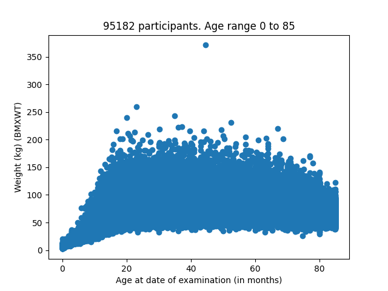

# NHANES_preprocessing

[](https://github.com/Deep-Learning-and-Aging/Website/actions/workflows/linter.yml)

Preprocessing of NHANES into different main categories.

The main categories that we are going to leverage are:
- demographics
- laboratory
- examination
- questionnaire

Feel free to start a discussion to ask anything [here](https://github.com/HMS-Internship/NHANES_preprocessing/discussions).

After extracting the data, if you have access to a cluster of computers, 35 minutes is needed to run the other steps ([Fusion](##II-Fusion), [Cleaning](##III-Cleaning), [Casting](##IV-Casting), [Merge](##V-Merge)) that will lead you to ready to use datasets containing only floats without missing values.

Shell scripts are available to launch jobs for Slurm clusters. They are always stored the same way: ./*step*/shell_script/run_*step*.sh

## [I Extraction](./extraction)
[Code in R]\
Start by restoring the R environment thanks to the [renv.lock](./renv.lock) file :
```R
renv::restore()
```
If you don't already have the package renv installed. Please install it following the [docs](https://github.com/rstudio/renv).

The file [extraction.Rmd](./extraction/extraction.Rmd) scrapes [NHANES website](https://www.cdc.gov/nchs/nhanes/index.htm) and stores the files in *./extraction/data/*.

Some files are only available with the format *.sas7dbat* so you need to convert them to the *.csv* format with the file [sas7bdat_to_csv.Rmd](./extraction/sas7bdat_to_csv.Rmd).

For the mortality dataset, files have been download from the [ftp server](https://ftp.cdc.gov/pub/health_statistics/nchs/datalinkage/linked_mortality/) of the 
Centers for Disease Control. Then, they have been processed using the file [mortality.Rmd](./extraction/mortality.Rmd).

## [II Fusion](./fusion)
[Code in Python]\
Start by installing the Python package thanks the the [setup.py](./setup.py) file:
```Python
pip install -e .[dev]
```
This stage has the goal to fusion the different files, given by the previous step, into one single file, representing a category. The way the categories are formed is shown in the google sheet [__variable_categorizer__](https://docs.google.com/spreadsheets/d/1wyfNAD_SgmIlKXK-2QFcBu7eH4xPJKbWe4PLOIIlriI/edit#gid=303839131). This google sheet reports the name of the variables with their description and the category they have been assigned to, along with other information. Among them, you have the correlations between the variables and the age of the participants.

You need to set the environment variable GOOGLE_SPLIT_SHEET_ID in order to interact with the google sheet __variable_categorizer__. A good way of doing it, is to set this variable in the *activate* file of your python virtual environment adding the following:
```Python
export GOOGLE_SPLIT_SHEET_ID="1wyfNAD_SgmIlKXK-2QFcBu7eH4xPJKbWe4PLOIIlriI"
```

## [III Cleaning](./cleaning)
[Code in Python]\
This stage cleans the files obtained in the previous step by removing the nans. After removing the nans, the columns with a null standard deviation are removed. It also creates the age of the participants for *demographics*. Finally, it creates a variable called __survival_type__ for *mortality* that tells the cause of death (cvd, cancer, other).

## [IV Casting](./casting)
[Code in Python]\
This stage casts the files obtained in the previous step by casting the types of the variables to float32. When a categorical variable is encountered, the variable is converted in dummy vectors.

## [V Merge](./merge)
[Code in Python]\
This stage merges the files obtained in the previous step with the demographics files and the mortality data. It also adds the description of the variables to their name.

## [VI Correlation with age](./correlation_with_age)
[Code in Python]\
This state is independant from the rest of the stages. It computes the correlation between the age and the variables. Thus, it updates the columns _age correlation_, _p-value_ and _sample size_ in the google sheet [__variable_categorizer__](https://docs.google.com/spreadsheets/d/1wyfNAD_SgmIlKXK-2QFcBu7eH4xPJKbWe4PLOIIlriI/edit#gid=303839131).

## [VII Scatter plot](./correlation_with_age)
[Code in Python]\
This state is also independant from the rest of the stages. It displays the scatter plot of a desired variable of NHANES with age in month as the X-axis. To use it:
```Bash
scatter_plot --main_category examination --variable BMXWT
```
Here is what you get for the weight of the NHANES participants:
<DIV ALIGN="CENTER">
<td></td> <br>
</DIV>